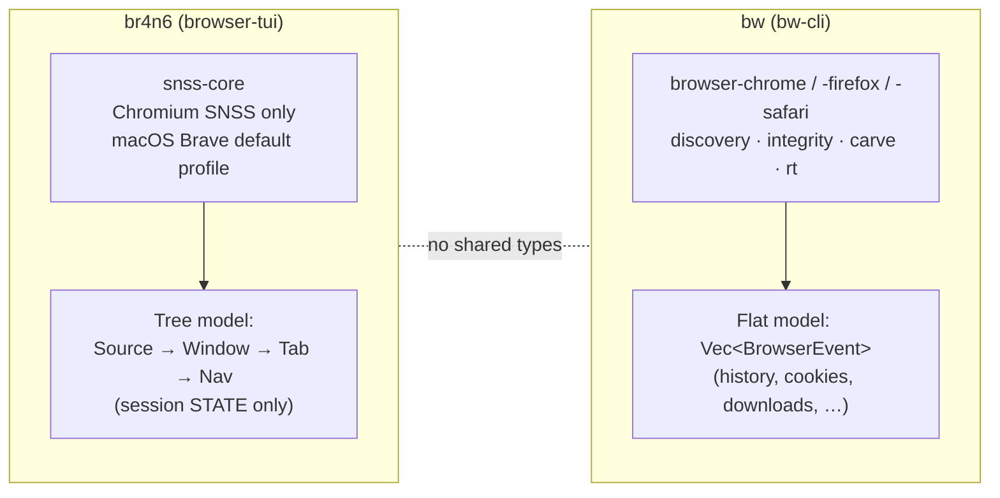
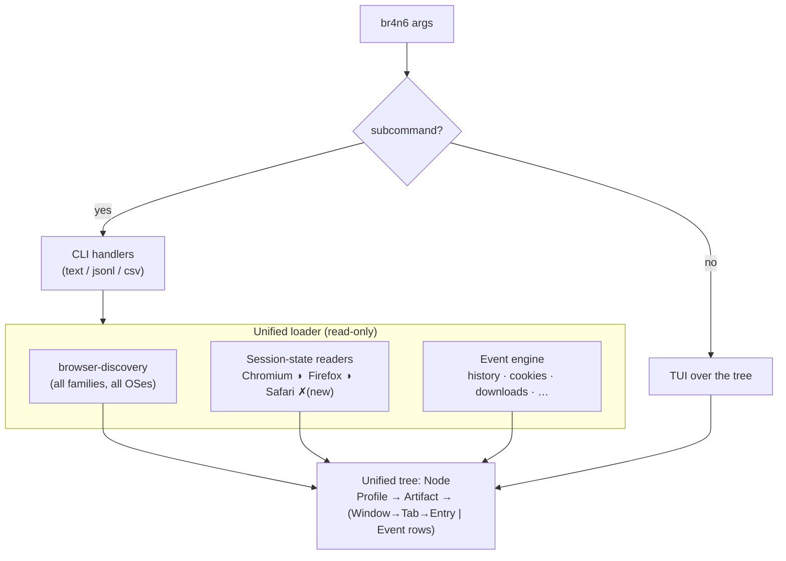
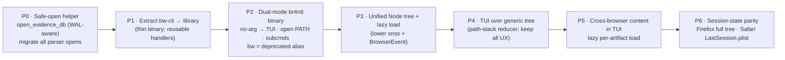

# br4n6 — one binary, two faces: a cross-browser, read-only forensic browser

Status: **Design (draft for review)** · Author: 4n6h4x0r · Date: 2026-06-09

## Executive Summary

**Decision.** Collapse the two binaries we ship today — `br4n6` (an interactive TUI that reads **only** Brave/Chromium session state, on macOS, from the default profile) and `bw` (a cross-browser forensic **CLI**) — into a single binary, `br4n6`, that is **a CLI and a TUI at once**:

- `br4n6` with **no arguments** → launches the TUI, auto-discovering every browser profile on the host.
- `br4n6 <PATH>` → launches the TUI scoped to a path (a live profile, a mounted evidence image, a forensic copy).
- `br4n6 <subcommand> …` → behaves exactly like `bw` does today (scriptable, machine-readable output).

**Why it only reads Brave/Chromium today** is not a deep limitation — it is an accident of wiring. The TUI was built directly on `snss-core` (a Chromium-only *session-state* decoder) and never connected to the cross-browser engine (`browser-chrome` / `browser-firefox` / `browser-safari`) that the CLI already uses. The fix is to put a **single unified data model** under both faces so the TUI inherits the engine's reach.

**Top recommendation.** Introduce one navigable tree model (`Profile → Artifact → …`) that both session-state readers and the flat `BrowserEvent` engine lower into. The TUI becomes a generic browser over that tree; the CLI keeps emitting the same events. One model, one loader, two presentations.

**Top risks (and where they bite).**

1. **Forensic soundness — we currently open evidence read-write.** Every engine crate calls `Connection::open(path)` (read-write). On a live or imaged SQLite database this can checkpoint/replay the WAL and **mutate the evidence**. This must be fixed (immutable / `mode=ro`) as part of, and arguably *before*, this work. This is the single most important finding in this document.
2. **The TUI's navigation model is hardcoded to a 4-level tree** (`selection: [usize; 4]`, `MAX_DEPTH = 3`). Generalizing to a variable-shaped tree is a real refactor of the reducer — though the hard parts (search, tag, glob, sort, export) are already tree-walks and port cleanly.
3. **"Every browser" is two different jobs.** History/downloads/cookies/etc. are *already* cross-browser in the engine and come almost for free. Cross-browser **session state** is not: Chromium ✓ and Firefox ✓ have readers; **Safari has none**. We must scope and label that honestly rather than implying uniform coverage.

**Scope of this document.** Design and phased plan only. No code is changed here. Phase 1 (read-only hardening + binary unification) is independently shippable and is the recommended first cut.

---

## 1. Who uses this, and what they are trying to do

Design proceeds from personas and their use cases, not from what is easy to build.

### Persona A — Dana, DFIR analyst (primary, interactive)

Investigating a seized laptop. Has mounted an image read-only at `/mnt/evidence`. Wants to **see every browser's history and open/recently-closed tabs in one place**, tag the URLs that matter, and export them into a report. Cares about: (1) never altering evidence, (2) *all* browsers, not just one, (3) correlating across artifacts on a timeline, (4) clean Markdown/JSON export with provenance.

> `br4n6 /mnt/evidence/Users/suspect` → a tree of every profile found under that path; drill, search `/`, tag with `Space`/`+`, export with `e`.

### Persona B — Ravi, incident responder (scripted + interactive)

Live triage on a running host, time-boxed, often over SSH. Wants a one-shot machine-readable dump for the case file, then a quick human look.

> `br4n6 triage --format jsonl > case/browsers.jsonl` then `br4n6` to eyeball. Cares about: speed, stable JSON schema, exit codes, and **zero accidental writes** to a running user's profile.

### Persona C — 4n6h4x0r, threat hunter on own machine (zero-config interactive)

Wants to see what each browser on *this* machine knows, immediately, with vi keys.

> `br4n6` (no args) → instant tree of my own profiles. Cares about: zero configuration, speed, muscle-memory navigation.

### Persona D — SOC pipeline (non-interactive automation)

A scheduled job parsing collected artifacts. Never opens a TUI.

> `br4n6 history /collected/Default/History --format jsonl`. Cares about: deterministic output, a schema that does not churn, and a non-zero exit on failure.

**What the personas tell the design:**

| Need | Design consequence |
|---|---|
| Never alter evidence (A, B) | Read-only/immutable opens are **mandatory and default**, not a flag |
| Every browser in one view (A, C) | One unified tree fed by the cross-browser engine |
| Scriptable *and* interactive (B) | One binary, mode chosen by arguments |
| Zero-config (C) | No args → discover-and-show |
| Stable machine output (B, D) | CLI subcommands and JSON schema unchanged from today's `bw` |

---

## 2. Where we are today



Two binaries, two data models, no overlap. The TUI is rich (vi keys, two-pane Midnight-Commander layout, incremental search, tagging, glob-tag, Markdown/JSON export) but format- and OS-narrow. The CLI is broad but has no interactive face.

**The core mismatch.** The TUI navigates a *tree* (`Source→Window→Tab→Nav`, from `snss-core`). The CLI emits a *flat stream* (`Vec<BrowserEvent>`). They share no types. That gap — not the missing clap branch — is the design problem.

A second, subtler point the personas surface: the TUI shows **session state** (which tabs/windows were open), while the CLI mostly shows **history** (what was visited). "Make it read state *and* history" means the unified model must hold **both classes of artifact**.

---

## 3. Target architecture

### 3.1 One model under both faces



The CLI keeps producing `BrowserEvent`s exactly as today (Persona B/D schema stability). The TUI consumes the **tree**. Both are fed by one loader that opens everything read-only.

### 3.2 The unified tree (`Node`)

A single navigable node type, deep enough for both artifact classes:

```rust
/// A navigable node in the unified browser tree.
pub struct Node {
    pub label: String,          // the row text the TUI shows
    pub kind: NodeKind,         // Profile | Artifact | Window | Tab | Entry | EventRow | Group
    pub item: Option<Item>,     // Some(..) at navigable leaves
    pub children: Vec<Node>,
}

/// The payload that search / tag / yank / export operate on, uniformly.
pub struct Item {
    pub url: Option<String>,
    pub title: Option<String>,
    pub timestamp_ns: Option<i64>,
    pub browser: BrowserFamily,
    pub artifact: ArtifactKind,
    pub attrs: serde_json::Map<String, serde_json::Value>,
}
```

- The existing snss `Source→Window→Tab→Nav` lowers into `Node`s with an `Item` at each `Nav`/tab leaf.
- A `Vec<BrowserEvent>` (history, downloads, …) lowers into an `Artifact` node whose children are `EventRow` leaves, each carrying an `Item`.
- `search`, `tag_by_glob`, `sort`, `export`, `yank` become **walks that collect `Item`-bearing nodes** — which is exactly what today's reducer already does over the fixed hierarchy.

### 3.3 Navigation refactor: array → path stack

Today: `selection: [usize; 4]`, `depth: 0..=3`, `MAX_DEPTH = 3` — a fixed 4-level tree baked into the reducer.

Target: a path stack over a variable tree.

```rust
pub struct Cursor {
    path: Vec<usize>,   // selected index at each level, root → current depth
}
```

- **Down/Up** — change `*path.last()`, clamped to the current level length.
- **Descend** — if the addressed node has children, `path.push(0)`.
- **Ascend** — `path.pop()`.
- **level length at depth d** — number of children of the node addressed by `path[0..d]`.

Every existing key (`gg`, `G`, `Ctrl-d/u/f/b`, `}`/`{`, `/`, `?`, `n`, `N`, `*`, `o`, `y`, `Y`, `e`, `r`, `s`, `Space`, `+`, `-`, `q`) keeps its meaning; only the addressing underneath changes. The search/tag/sort/export logic is preserved because it already operates by walking the model and collecting leaves.

### 3.4 Dual-mode dispatch (clap)

A bare top-level positional `PATH` is **ambiguous against subcommand names**: a real evidence directory named `history`, `profiles`, `cookies`, or `session` collides grammatically with a subcommand, and clap resolves grammar before intent. `args_conflicts_with_subcommands` does *not* fix this — it only prevents mixing the two, it does not disambiguate a path that happens to be spelled like a subcommand. So the design must not put a free positional path at the top level.

Resolution — make the two modes **grammatically disjoint**:

```rust
#[derive(Parser)]
#[command(name = "br4n6", version, about)]
struct Cli {
    #[command(subcommand)]
    command: Option<Commands>,   // None → TUI on auto-discovered host
}

#[derive(Subcommand)]
enum Commands {
    /// Open the interactive TUI on a path (profile dir, evidence mount, copy).
    Open { path: PathBuf },
    // …existing bw subcommands: History, Cookies, Downloads, Triage, …
}
```

- `br4n6` (no subcommand) → TUI, auto-discovering this host.
- `br4n6 open <PATH>` → TUI scoped to a path. The verb removes all ambiguity; a directory named `history` is just `br4n6 open history`.
- `br4n6 <subcommand> …` → CLI, exactly as `bw` today.

This keeps the zero-config interactive path (Persona C) *and* the explicit forensic path (Persona A) while staying parseable. (A convenience heuristic — "if the sole argument is an existing path, imply `open`" — can be layered on later behind the unambiguous grammar, never as the primary contract.)

**One concept, one name** (cognitive-load discipline): the nouns are identical across both faces — *Profile*, *Artifact* (History / Session State / Downloads / Cookies / …), and the family names (Chromium / Firefox / Safari). A reader who learns the CLI already knows the TUI's vocabulary.

### 3.5 `bw` → `br4n6` migration

`bw`'s command handlers move into a reusable library (e.g. `browser-cli` or fold into `browser-rt`) so the binary is a thin shell and the TUI loader can reuse the same parsing entry points (DRY). `bw` remains for one release as a **thin deprecated alias** that prints a notice and forwards to `br4n6`, then is removed.

---

## 4. "Make it work on every browser" — split honestly

The phrase hides two very different efforts.

### 4.1 History / downloads / cookies / bookmarks / extensions / autofill / login-data — mostly there, with named holes

Most event artifacts are cross-browser in the engine (`browser_chrome::parse_*`, `browser_firefox::parse_*`, `browser_safari::parse_*`); the loader calls them per discovered profile and lowers the `BrowserEvent`s into `Artifact` nodes. But coverage is a **matrix with real gaps**, not uniform — and the design must surface the gaps, not paper over them. The CLI today hard-rejects several Safari artifacts (`bw-cli/src/main.rs:195-217`):

| Artifact | Chromium | Firefox | Safari |
|---|:--:|:--:|:--:|
| History · Cookies · Downloads · Bookmarks | ✓ | ✓ | ✓ |
| Extensions | ✓ | ✓ | ✓ |
| Login data | ✓ (metadata) | ✓ (metadata) | ✗ rejected |
| Autofill | ✓ | ✓ | ✗ rejected |
| Cache | ✓ | ✓ | ✗ rejected |

So the win is large but not total: Chromium and Firefox are broad; **Safari has three missing parsers**. The unified view must render those cells as "not available for this family," never as an empty list that reads like "nothing found" (fail-loud / no silent caps).

**Encrypted fields are out of scope (metadata-only), and that must be explicit.** Chrome cookie values surface as `"ENCRYPTED"` and login `password` as `"ENCRYPTED"` (`browser-chrome/src/{cookies,login_data}.rs`); Firefox `encryptedPassword` is never read. The merged tool is a **metadata** tool — Keychain/DPAPI/`nss` decryption is a deliberate non-goal here, called out so a reader does not assume secrets are exposed (secure-by-design: we structurally never emit a plaintext secret).

### 4.2 Session / tab **state** — uneven, must be labeled

| Family | State source | Reader today |
|---|---|---|
| Chromium | SNSS `Session_*` / `Tabs_*` / `Apps_*` | ◑ **rich tree only via `snss-core` (TUI path)**; `browser_chrome::parse_session` exists but emits flat events and is **not wired into the CLI** (the CLI's `Session` arm rejects non-Firefox, `bw-cli/src/main.rs:207-210`) |
| Firefox | `sessionstore.jsonlz4` / `recovery.jsonlz4` | ◑ **flat / current-tab-only** — `browser_firefox::parse_session` keeps `entries.last()` per tab (`session.rs:50`), dropping nav history, window/tab indices, and selected-tab state |
| Safari | `~/Library/Safari/LastSession.plist` | ✗ **none** (`plist` is already a workspace dep) |

So "session state for every browser" is the **least-done** part of "every browser," and the honest status is:

- Only **Chromium** has a *rich* session tree, and only through `snss-core` — the format the current TUI already speaks.
- **Firefox** session reading exists but is **lossy** (current entry per tab); reconstructing the full `Window → Tab → Nav` tree from `sessionstore.jsonlz4` is **new work**, not a wiring exercise.
- **Safari** has **no** session reader at all.

Implication for the `Node` tree: do **not** design branches that imply parity which the readers cannot fill. Where a family's session state is lossy or absent, the tree shows that explicitly (a labelled, empty-but-annotated branch), rather than a hollow node that looks like real data.

### 4.3 Discovery breadth

`browser-discovery` enumerates Chrome, Edge, Brave, Vivaldi, Opera, Arc, Chromium, and Firefox across macOS, Linux, and Windows — a strong base the loader builds on directly. Two known narrownesses to keep honest: **Arc** is registered only under its macOS path, and **Safari** discovery is macOS-only by nature (`Library/Safari/History.db`). These are acceptable (Arc/Safari are macOS-first products) but should be documented, not implied away.

---

## 5. Forensic soundness — the non-negotiable

**Finding:** every primary SQLite open in the engine is `Connection::open(path)` — **read-write** (Chrome `history.rs`/`cookies.rs`, Firefox `history.rs`, Safari `history.rs`, `browser-integrity`). No parser uses `OpenFlags`, `mode=ro`, or `immutable`. Opening a live or imaged browser database read-write can trigger a WAL checkpoint and **alter the evidence file**. For a forensic tool this is a correctness defect, not a nicety. (Carving is exempt — `browser-carve` reads raw bytes via `std::fs::read`, not a connection.)

**The subtlety that makes naïve "read-only" wrong: the `-wal` file.** A browser DB that was open carries a sidecar `-wal` holding the **most recent, not-yet-checkpointed** rows — often the forensically interesting ones. Two failure modes:

- `immutable=1` tells SQLite to **ignore the `-wal` entirely** → you open cleanly but **silently miss the newest data**. Wrong for forensics.
- Plain read-write open → SQLite may **checkpoint the WAL into the main DB**, mutating evidence. Also wrong.

**Required design (secure by default) — copy the unit, then read the copy:**

- The atomic unit of evidence is **`{db, db-wal, db-shm}` together**, not the main file alone. (`browser-integrity` already treats a non-empty sibling `-wal` as significant; `browser-carve` reads `db-wal` directly — both confirm the WAL carries state.)
- For a **live/locked** profile (Chrome/Firefox lock `History`/`places.sqlite` while running): **snapshot all three siblings to a temp working copy, then open the copy with `OpenFlags::SQLITE_OPEN_READ_ONLY`** (WAL *honored*, so the newest rows are read; any checkpoint touches the disposable copy, never the original). Never `immutable=1` here.
- For a **static evidence artifact with no `-wal`** (a clean export/image), opening the original with `immutable=1` is safe and avoids a copy.
- The safe path is the **only** path in the default API surface — a single `open_evidence_db(path) -> Connection` helper encapsulates the WAL-aware decision; there is no raw `Connection::open` for callers to reach for (secure-by-design: the unsafe option is not offered).
- **Chain of custody is first-class, not retrofitted.** A snapshot records `{original_path, snapshot_path, sha256, copied_at}`; this provenance rides along in exports. `BrowserEvent.source` and `TriageReport` carry only a path today, so these fields are **new schema** — added additively so the existing JSON contract for Personas B/D does not break.
- Reader caveats from `forensicnomicon` (`ForensicMeta`) continue to ride along in JSON/Markdown output.

This is the **first** phase because it protects evidence regardless of whether the rest of the unification ships — and because every later phase reads through this helper.

---

## 6. Phased plan (TDD throughout — RED then GREEN, separate commits)

The original draft bundled "read-only hardening + binary unification" into one P1. Review showed those are **unrelated risks at different readiness levels** — read-only hardening is shippable now; unification depends on first extracting the CLI into a library. They are split below.



0. **P0 — Safe-open helper (forensically urgent, fully self-contained).** Add `open_evidence_db` (WAL-aware copy-then-`READ_ONLY`, per §5); migrate every `Connection::open` in the parser/integrity crates to it. Tests prove no checkpoint of the original and that `-wal` rows are still read. *Ships on its own; nothing else depends on the rest of this design.*
1. **P1 — Extract `bw-cli` into a library.** Move the subcommand handlers into a reusable crate so the binary is a thin shell. No behaviour change; existing CLI tests stay green. Prerequisite for unification.
2. **P2 — Dual-mode `br4n6` binary.** `br4n6` (no subcommand) → TUI; `br4n6 open <PATH>` → scoped TUI; `br4n6 <subcommand>` → CLI via the P1 library. `bw` becomes a deprecated alias.
3. **P3 — Unified `Node` tree + lazy loading.** Define `Node`/`Item`; lower `snss::Source` and `Vec<BrowserEvent>` into it. **Children are produced lazily on descend** (see §8) so a multi-profile host never eager-loads millions of rows. Pure-data, unit-testable.
4. **P4 — Generic-tree TUI.** Replace the `[usize; 4]`/`MAX_DEPTH` reducer with the path-stack cursor over `Node`; re-point search/tag/sort/export at the generic walk. Behaviour-preserving — existing TUI tests stay green.
5. **P5 — Cross-browser content in the TUI.** Loader feeds history/downloads/cookies/etc. for every discovered profile into the tree (lazily). The visible "now it reads every browser" moment; renders the §4.1 gaps as labelled-unavailable cells.
6. **P6 — Session-state parity.** Reconstruct the full Firefox `Window→Tab→Nav` tree from `sessionstore.jsonlz4` (today it is current-tab-only); add the Safari `LastSession.plist` reader; normalize all session readers to one `Node` shape.

**Doer-Checker / real-data validation.** Per discipline, each reader phase is validated against **real** artifacts (a real Safari `LastSession.plist`, real `sessionstore.jsonlz4` with multi-entry tabs, real History/places DBs **with a populated `-wal`**), not only synthetic fixtures — real generators carry quirks synthetic ones miss. The `-wal` case is explicitly in the P0 test matrix, since that is where naïve read-only silently loses data.

---

## 7. Downstream consumer: `browsing-state-mcp`

`browsing-state-mcp` (the MCP server exposing browser history/state to AI agents, secret-free and PII-redacted) is a **third** consumer of this same data, alongside the CLI and TUI. The unified model is an opportunity, not just a refactor: if `Node`/`Item` (or the `BrowserEvent` schema it lowers from) is the one source of truth, the MCP server, the CLI, and the TUI stay in lockstep instead of drifting. Two constraints fall out:

- Schema changes from §5 (chain-of-custody fields) and §3.2 (`Item`) must be **additive** so the MCP server's existing contract does not break.
- The MCP server's secret-free / PII-redaction guarantee must hold through the unified path — the metadata-only stance in §4.1 (never emit a plaintext secret) is what makes that structurally safe across all three faces.

---

## 8. Performance & memory — lazy by construction

A naïve loader that eager-parses every artifact of every profile into one tree will not survive real evidence: parsers collect full `Vec<BrowserEvent>` in memory, and a heavily-used Chrome profile holds **millions** of history rows. Multiply by several profiles and several artifact classes and the TUI would stall on launch and balloon memory.

The model is therefore **lazy by construction**:

- **Discovery is cheap and eager** (just profile dirs); **artifact parsing is deferred** until a node is descended into. Opening `br4n6` lists profiles instantly; the History DB for a profile is parsed only when the analyst opens that branch.
- **Bounded views by default** — leaf lists render windowed/paginated, not by materializing every row at once (the CLI already caps some output, e.g. triage's 50-event preview).
- **Snapshot/parse cost is paid once per descended artifact** and cached for the session; reload (`r`) re-snapshots.
- This shapes the `Node` API (P3): children are produced by a **thunk** the cursor invokes on descend, not a pre-built `Vec`.

Cross-browser, cross-profile **timeline correlation** (a merged chronological view) is explicitly deferred — it is a separate artifact class with its own memory profile, not a free side effect of the tree (see open question 4).

---

## 9. Open questions for the reviewer

1. **Keep `bw` as a permanent alias, or remove after one release?** (Recommendation: deprecate now, remove next minor.)
2. **Snapshot-on-lock location** — system temp vs. a user-specified evidence working directory (chain-of-custody implications; the latter is friendlier to documented custody).
3. **Timeline correlation across browsers** — is a merged, cross-profile chronological view in scope for the TUI soon, or a later artifact-class of its own?
4. **Firefox session depth** — is current-tab-per-tab (today's behaviour, surfaced honestly) acceptable for an interim P5, with the full `Window→Tab→Nav` reconstruction landing in P6, or must full fidelity land together?

---

*Validation note:* claims were checked against the current `feat/history-state-browser` tree — `crates/browser-tui/src/{main,lib}.rs`, `crates/bw-cli/src/main.rs` (incl. the Safari/session rejections at `195-217`), `crates/browser-core/src/lib.rs`, `crates/browser-discovery/src/lib.rs`, `crates/snss-core/src/lib.rs`, `crates/browser-firefox/src/session.rs:50` (the `entries.last()` flattening), and the `Connection::open` sites across `browser-chrome/-firefox/-safari`. This revision incorporates an adversarial Codex review; note the review was run against a worktree branched from `main`, which predates the `browser-tui`/`snss-core`/`browsing-state-mcp` crates — so its "these crates do not exist" findings are review-environment artifacts, while its branch-independent findings (Firefox session is lossy, Safari artifact gaps, the `immutable=1`-vs-`-wal` hazard, clap path/subcommand ambiguity, eager-load memory risk, P1 over-bundling) are all incorporated above. The `immutable=1`-vs-`-wal` correction in §5 is the highest-impact change from the review.
