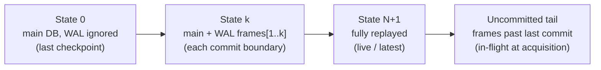
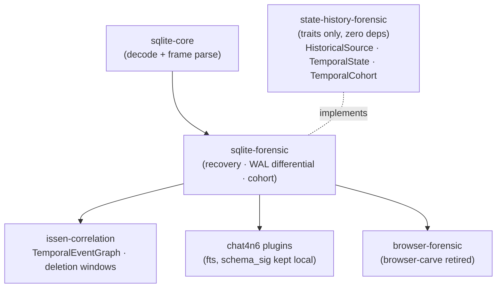

# A fleet-wide `sqlite-forensic` crate — one SQLite layer, WAL as a time axis

Status: **Design / recommendation (draft for review)** · Author: 4n6h4x0r · Date: 2026-06-09

## Executive Summary

**Recommendation: yes, eventually — create `~/src/sqlite-forensic` as the fleet's single SQLite layer**, extracted from the already-built engine in `~/src/chat4n6/crates/chat4n6-sqlite-forensics`. But the cost is materially higher than a lift-and-shift, and an adversarial code review (folded in below) corrected the original estimate. The engine is genuinely pure-Rust and slice-based with **no runtime `libsqlite3`** (`rusqlite` is dev-only, `Cargo.toml:21`) — a rare and valuable property — **but it is not fleet-neutral**: `chat4n6-plugin-api` is a *production* dependency (`Cargo.toml:16`), and its types (`EvidenceSource`, `WalDelta`) are threaded through the core data structures (`record.rs:12,17`, `wal.rs:5`, `carver.rs`, `unalloc.rs:3`). So the gating first task is **decoupling those types**, not setting `fts.rs`/`schema_sig.rs` aside.

Doing this still resolves four real problems, but with the corrected scope:

1. **The read-write evidence-mutation defect** in `browser-forensic` (every `Connection::open(path)` is read-write) — a pure-Rust slice reader **cannot** auto-checkpoint, so mutation becomes *structurally impossible*. (Caveat in §3: this applies to *recovery/temporal* reads; routine allocated browser reads should stay on **read-only `rusqlite`**, not a reimplemented query engine.)
2. **The "WAL = two points in time" request** — `chat4n6` already implements the **2-state** case (`WalMode::Both` is a last-writer-wins overlay diff: walk the b-tree over raw pages vs. over the collapsed overlay, emit added/deleted — `wal.rs:245,293,306`). The **`(2+N)` per-commit-boundary** states Issen wants are **new work** (§2), not a cheap generalization.
3. **Issen's `[H]` State-History functor at SQLite granularity** — the `(2+N)`-state model is what this crate *would* produce, **but** the `state-history-forensic` traits crate it must implement (`HistoricalSource`) **does not exist yet** (`STATE_HISTORY_PLAN.md:534` — planned). Integration is gated on that.
4. **Weak-duplication** — `browser-carve` and `chat4n6` overlap in *intent* but not code: `browser-carve` pattern-matches ASCII `http` strings in freelist/WAL pages (`sqlite_carve.rs:54,110`), while `chat4n6` decodes record headers/serial-types (`carver.rs:22,71`). So this is **supersession by a higher-fidelity carver**, not removing a literal copy — still a win.

**Split per the fleet convention** (`<x>-core` raw reader + `<x>-forensic` anomaly auditor): `sqlite-core` (header/page/btree/varint/record/freelist/WAL-frame decode, **neutral types, no fleet provenance**) and `sqlite-forensic` (recovery, carving, WAL differential, temporal cohort, integrity → `forensicnomicon` findings — note chat4n6 currently emits its *own* `VerifiableFinding`/`VerificationReport` at `verify.rs:9,20`, so the `forensicnomicon` contract is an adapter to build).

**Two real extraction risks** the original draft under-weighted:
- **`&[u8]` whole-file → `Read + Seek` is a breaking refactor, not a nice-to-have.** Every b-tree offset indexes directly into one contiguous slice (`btree.rs:12,225,282`); browser `History`/`places.sqlite` reach gigabytes. Streaming touches every interior call site and the lifetime model.
- **Plugin-API decoupling permeates the crate** (see above) and must land *before* the `core`/`forensic` line can be drawn.

**Scope of this document:** recommendation + architecture + migration sequence. No code is moved here.

---

## 1. The DRY case — three repos, one set of SQLite primitives

| Repo | What it does with SQLite today | Problem |
|---|---|---|
| `chat4n6` | Full pure-Rust forensic engine (`chat4n6-sqlite-forensics`, 22 modules): WAL differential, btree walk, varint/serial-type, freelist/freeblock, carving, integrity | Locked inside the chat product; not reusable by the fleet |
| `browser-forensic` | `browser-*` parsers open via **read-write** `rusqlite`; `browser-carve` **reimplements** freelist/WAL carving | Evidence-mutation risk; duplicated, weaker carving |
| `issen` | Plans `issen-sqlite-history` as a *thin wrapper around chat4n6's WAL reader* (`STATE_HISTORY_PLAN.md:543-545`) | Already assumes chat4n6's engine is the source of truth — but via an ad-hoc bridge |

All three want the same primitives. Issen's own plan already points at chat4n6 as the engine. The honest conclusion: **promote chat4n6's SQLite engine to a first-class fleet crate** and have everyone — including chat4n6 — depend on it.

---

## 2. The crown jewel: WAL as a time axis (Issen `[H]` at SQLite granularity)

The user's framing — *"with-`-wal` and without-`-wal` as two points in time, the history axis"* — is exactly Issen's model, and chat4n6 already codes the degenerate case.

**Issen's general model** (`STATE_HISTORY_PLAN.md:215-231`): a SQLite WAL with `N` committed transactions yields `(2 + N)` states —

- **State 0** — `main.db` with the `-wal` *ignored*: the database as of the last checkpoint (an *earlier* point in time).
- **State k** — `main.db` + WAL frames `[1..k]` applied: the state at each commit boundary.
- **State N+1** — fully replayed: the *live/latest* state.
- **Uncommitted tail** — frames beyond the last commit: transactions in flight at the moment of acquisition (often the most interesting).

**What chat4n6 already has** (`chat4n6-sqlite-forensics`) — the **2-state** case:

- `WalMode::{Both, Apply, Ignore}` (`db.rs:10-14`). `Both` builds a WAL overlay by **collapsing *all* frames** to their final per-page state (last-writer-wins, `wal.rs:245,261`), then walks the b-tree twice — over the raw pages (pre-replay) and over the overlay (post-replay) — dedups by record hash, and classifies: records only in the post view are **added** (`WalPending`), records only in the pre view are **deleted** (`WalDeleted`) (`wal.rs:293,306`). This is a **two-snapshot diff**, not commit-boundary tracking.
- `wal_enhanced.rs` has a **per-frame** classifier (Committed / Uncommitted / Superseded, `wal_enhanced.rs:16,35`), but two caveats: it is **not on the main recovery path** (`db.rs` calls `recover_layer2_enhanced` in `wal.rs`, not this classifier), and `Superseded` is **exclusive** of `Committed` (`wal_enhanced.rs:127`) — the states are not independently composable.

**The gap to close for Issen is real new work, not a generalization.** Issen wants the full **`(2+N)`-state cohort** with `TemporalCohort::diff(a, b) -> StateDelta` (`STATE_HISTORY_PLAN.md:501`). The current overlay is a *single* collapsed page-map walked *once*; producing a distinct state at **each commit boundary** requires either incremental overlay snapshots (page-map duplication per commit) or a replay-log structure that does not exist today. Budget this as a **new capability**, with its own fixtures (a multi-transaction WAL exercised at each boundary — no such test exists today).

**Mapping to the framework:** `sqlite-forensic` *is* the `[H]` functor applied at SQLite granularity — it lifts one `(main.db, -wal, -shm)` artifact into a time-indexed `Vec<TemporalState>`. The deletion-window inference Issen wants (`message present in state A, absent in state B → deleted in (A,B]`) falls straight out of `diff()`.

---

## 3. Secure by design — why pure-Rust beats "open read-only"

The `br4n6` design doc proposed a WAL-aware `open_evidence_db` helper (copy `{db,-wal,-shm}`, then open `READ_ONLY`). That is correct but still routes through `libsqlite3`, which has historically surprising checkpoint/recovery behavior. **chat4n6's approach is strictly stronger:**

- The reader takes `&[u8]` and never hands the file to `libsqlite3`, so **it physically cannot checkpoint, recover, or write** — the unsafe operation is not *in the API surface* (the strongest form of secure-by-design: the wrong thing is unconstructible).
- The `-wal` is parsed as raw frames, so State 0 (WAL-ignored) is obtained by *not applying frames* — no risk of libsqlite3 silently replaying them.

**Settled decision (was an open question): keep read-only `rusqlite` for routine allocated reads; use `sqlite-forensic` only for temporal/deleted/carved recovery.** Browser parsers run real SQL with joins, filters, and ordering — Chromium joins `visits`⋈`urls` (`visits.rs:67`), Firefox downloads join three tables filtered on annotation name (`downloads.rs:20`), Safari joins visits⋈items (`history.rs:21`). Reimplementing projection/join/`WHERE` evaluation over raw b-tree walks is a **query-engine rewrite**, not an extraction — a trap. So the safe-open fix for *allocated* reads is simply switching those `Connection::open` calls to **read-only flags** (`SQLITE_OPEN_READ_ONLY`, and copy `{db,-wal,-shm}` when locked). The pure-Rust engine earns its keep on the things SQL *cannot* see: deleted rows, freelist/unallocated carving, and the WAL time axis.

---

## 4. Naming & the core/forensic split

Per `issen/CLAUDE.md:292-304` (reader = `<x>-core`, analyzer = `<x>-forensic`, always):

| Crate | Owns | From chat4n6 modules |
|---|---|---|
| **`sqlite-core`** | Raw decode, no findings: header, page-type, b-tree walk, varint, serial-type/record, freelist/freeblock, **WAL frame parsing**, overlay construction | `header.rs`, `page.rs`, `btree.rs`, `varint.rs`, `record.rs`, `freelist.rs`, `freeblock.rs`, `wal.rs` (frame parse + overlay), `page_map.rs` |
| **`sqlite-forensic`** | Interpretation → `forensicnomicon` findings: deleted/carved recovery, WAL **differential & temporal cohort**, integrity/tamper, pragma anomalies | `carver.rs`, `unalloc.rs`, `gap.rs`, `journal.rs`, `wal_enhanced.rs` (classification), `verify.rs`, `pragma.rs`, `dedup.rs`, `rowid_gap.rs` |

**Boundary question for review:** does the **temporal-state builder** (collapse frames `[1..k]` → a `TemporalState`) live in `-core` or `-forensic`? Argument for `-core`: it is pure decode (apply frames, present bytes). Argument for `-forensic`: *attributing* a delta as "deletion" is interpretation. Proposed line: **frame parsing + state materialization → `-core`; delta/anomaly attribution → `-forensic`.**

**Prerequisite the review surfaced:** the would-be `-core` types are *currently coupled to chat*. `RecoveredRecord` carries a `chat4n6-plugin-api::EvidenceSource` (`record.rs:12,17`) and the WAL path imports `WalDelta`/`WalDeltaStatus` from the same crate (`wal.rs:5`). Before the `core`/`forensic` line can be drawn, define **neutral** `SqliteRow` / `WalFrame` / `PageRef` types in `sqlite-core` with no fleet provenance attached; provenance (`EvidenceSource`, findings) belongs above, in `-forensic` and its consumers.

> Note on the user's phrasing: the proposal named one crate `sqlite-forensic`. The fleet convention makes that the **workspace/repo** name, containing both `sqlite-core` and `sqlite-forensic` members (the same shape as `ntfs-forensic` → `ntfs-core` + `ntfs-forensic`).

---

## 5. Integration with Issen's State-History layer

- `sqlite-forensic` **implements** `state-history-forensic::HistoricalSource`, emitting a `TemporalCohort` per `(db,-wal)` unit. Issen's planned `issen-sqlite-history` wrapper (`STATE_HISTORY_PLAN.md:543-545`) **shrinks to an adapter or disappears**.
- `chat4n6` deletes its in-tree copy, depends on `sqlite-forensic`, and keeps only `fts.rs` / `schema_sig.rs` as plugin-side code.
- **Decoupling:** chat4n6's engine depends on `chat4n6-plugin-api` for `EvidenceSource` / `WalDelta`; move those two types **into `sqlite-forensic`** so the shared crate has no chat dependency (the survey flags this as light).

---

## 6. Impact on `browser-forensic`

- **Supersede `browser-carve`'s SQLite carving** — it pattern-matches `http` strings in freelist/WAL pages (`sqlite_carve.rs:54,110`); `sqlite-forensic`'s record-header/serial-type carver is higher fidelity. Retire the former onto the latter. (Non-SQLite carving, if any, stays.)
- **`browser-*` parsers** — switch the read-write `Connection::open` sites to **read-only `rusqlite`** (`SQLITE_OPEN_READ_ONLY`; copy `{db,-wal,-shm}` when the live DB is locked). This is the concrete form of the `br4n6` design doc's P0 `open_evidence_db`; the shared safe-open helper is the better home, but the *fix itself does not need the full extraction* — it can land immediately. Pure-Rust `sqlite-forensic` is additive on top, for deleted/temporal recovery.
- **`snss-core` is untouched** — SNSS is a Pickle-based format, not SQLite.
- **Bonus:** browser history gains WAL temporal awareness for free — "tabs/visits present in the live state but absent at last checkpoint" becomes a first-class query.

---

## 7. Migration sequence & open questions

**Recommended first step (de-risked, from the review) — prove the seam before committing the fleet.** Do *not* open by extracting the whole engine. Instead:

1. **Carve a minimal, fleet-neutral `sqlite-core`** from `header.rs`, `varint.rs`, `btree.rs`, and the WAL frame-parse/overlay parts of `wal.rs` — **stripped of `chat4n6-plugin-api`** (neutral `SqliteRow`/`WalFrame`/`PageRef`). Validate it against (a) one existing chat4n6 recovery test and (b) one `browser-forensic` read-only read path. *This single step proves the decoupling and the API shape before anything depends on it.*
2. **Then** lift `sqlite-forensic` (carving, WAL differential, integrity) onto `sqlite-core`, emitting `forensicnomicon::report::Finding` via an adapter (chat4n6 emits its own `VerifiableFinding` today, `verify.rs:9,20`).
3. **Repoint `chat4n6`** at the two crates (path dep during the coordinated change, registry once published); keep `fts.rs`/`schema_sig.rs` as plugin-side code.
4. **`browser-forensic`** — switch parsers to **read-only `rusqlite`** (allocated reads); retire `browser-carve`'s lower-fidelity SQLite carving onto `sqlite-forensic`.
5. **Only after `state-history-forensic` exists** (`STATE_HISTORY_PLAN.md:534`, not yet a crate): build the `(2+N)`-state cohort and implement `HistoricalSource`; collapse Issen's planned `issen-sqlite-history` to an adapter. The `&[u8]`→`Read + Seek` streaming refactor lands here or earlier, driven by real DB sizes.

**Correctness gaps the pure-Rust reader must address (review findings):**

- **Encrypted DBs (SQLCipher/SEE).** Header detection keys on the plaintext magic `SQLite format 3\0` (`header.rs:1,3`); encrypted files fail at parse with no graceful "encrypted, out of scope" signal. Add detection + explicit scope limitation.
- **Reserved-bytes / overflow.** Overflow math assumes **0 reserved bytes** in the usable page size (`btree.rs:282,288`); SQLCipher and some DBs use the reserved field (salt), which would mis-size overflow chains. Read the header's reserved-bytes field, don't assume 0.
- **`-shm` & checkpoint modes.** No `shm_data` is tracked (`db.rs:53`); after a partial checkpoint under `RESTART`/`TRUNCATE`, frame visibility depends on WAL-index state. `(2+N)` materialization must consult it or it can mis-classify frames.
- **`auto_vacuum=Incremental`.** Parsed but only `Full` suppresses freelist recovery (`pragma.rs:117`, `db.rs:256`); incremental keeps a pointer-map page affecting freelist logic — handle distinctly.

**Open questions for the reviewer:**

1. **core/forensic boundary** for the temporal-state builder (§4).
2. **Streaming**: is mmap/`&[u8]` acceptable interim, with `Read + Seek` mandatory before multi-GB browser DBs? (Leaning: mandatory before browser adoption at scale.)
3. **Versioning across 4 repos** during the coordinated extraction — who owns the cut; path → registry cadence.

---

*Validation note:* claims drawn from two read-only surveys of the actual trees. Issen model: `~/src/issen/{README.md,CLAUDE.md,STATE_HISTORY_PLAN.md}` (5 data sources `README.md:55-61`; `[H]` functor & `(2+N)`-state WAL model `STATE_HISTORY_PLAN.md:69-75,215-231`; `TemporalState`/`TemporalCohort`/`diff` `:484-505`; acquisition guidance `:419`). chat4n6 engine: `~/src/chat4n6/crates/chat4n6-sqlite-forensics/src/*` (`WalMode` `db.rs:10-14`; differential replay `wal.rs:289-335`; per-frame classification `wal_enhanced.rs`; ~95% liftable, only `fts.rs`/`schema_sig.rs` chat-specific). The whole-file `&[u8]` I/O boundary is the highest-confidence *effort* finding; the read-write-open defect in `browser-forensic` is the highest-confidence *correctness* finding.
