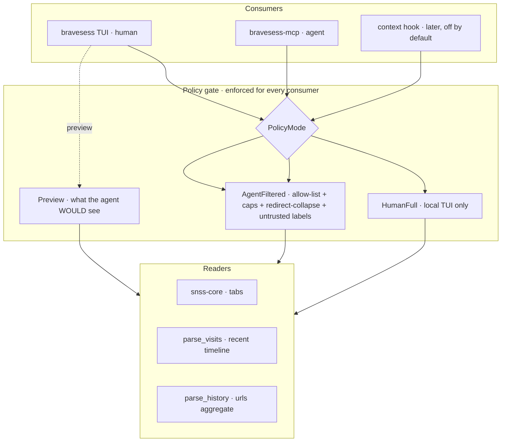

# Brave Sessions → Local Browsing-Context Layer — Enhancement Design

*Validated against an adversarial Codex critique; §11 lists what changed.*

## Executive Summary

**Recommendation.** Grow this project from "a TUI that reads SNSS session files" into a
**local, allow-list-gated browsing-context provider for AI agents**, with the existing
TUI as the human surface. The enabler is in-house: `~/src/browser-forensic` is your own
SecurityRonin fleet whose `browser-chrome` reads the Chromium History DB, and which has
**no SNSS session reader** — the exact gap `snss-core` already fills. The two repos are
complementary halves of one capability.

**The feature you asked for** — making an AI agent aware that "the user was browsing this
site 10 minutes ago" — ships as **one explicit MCP tool first**, not an ambient hook.
The minimum viable deliverable is a single opt-in command/tool that reads open + recently
-closed tabs (`snss-core`) plus the last *N* minutes of the History **`visits`** table,
behind an **allow-list**, returning a small structured digest with provenance. Everything
else (TUI history browsing, ambient hooks, forensic analysis, embeddings) waits until that
proves trustworthy.

**Should we read the whole browsing history? Yes — locally, for the human; never wholesale
for the agent.** The local TUI (you) may see everything; the agent sees only allow-listed,
bounded, provenance-tagged digests. These are different *policy modes* of one enforced path.

**Three reversals from the first draft, forced by the critique:**
1. **Allow-list by default for agent surfaces**, not deny-list. Sensitive material appears
   on GitHub, Slack, Google Docs, localhost, employer SSO, shortened URLs — un-deny-listable.
2. **MCP-pull first; ambient prompt-injection hook last and off by default.** Pushing
   browsing context into *every* prompt is the largest, least-scoped exposure surface.
3. **The `visits` table is in the first deliverable**, not Phase 4. `urls.last_visit_time`
   collapses repeat visits into one row and cannot reconstruct a 10-minute timeline.

**Top risks (detail in §7):** (1) AI exfiltration of sensitive domains; (2) **prompt
injection carried *inside* visited page titles/URLs** that an agent later ingests; (3)
plaintext history residue from snapshot copies; (4) scope creep. Each has a concrete
mitigation. Privacy is the gate, not a preference.

---

## 1. Reframing — what this tool is now

> **"Where have I been, and where am I now, on the web — queryable locally, by me or by my
> AI, with nothing leaving my machine, and only what I've allow-listed reaching the AI."**

| Source | Crate | Answers | Granularity |
|---|---|---|---|
| SNSS sessions | `snss-core` (built) | What's open now / just closed | Live tab/window state |
| History `visits` | `browser-chrome` + new `parse_visits` | What I visited, *when*, in sequence | Per-visit events (36,989) |
| History `urls` | `browser-chrome::parse_history` (drop-in) | Has this URL ever been seen; how often; last-seen | Per-URL aggregate (22,919) |

The agent-context goal needs **`visits`** for chronology; `urls` only answers
"ever/last/how-often." SNSS supplies the live window layout.

---

## 2. Personas & use cases

Focused on the two personas the bridge actually serves. P4 (forensic) and P5 (semantic
recall) are deliberately moved to the out-of-scope appendix (§12) — they pull toward the
whole forensic fleet before the basic agent path is proven.

| # | Persona | Need | Job to be done |
|---|---|---|---|
| **P1** | The Recaller (you, human, local) | Find a tab/URL you remember | "That issue I had open an hour ago?" |
| **P2** | **The AI Agent** (primary new user) | Bounded, provenance-tagged context | "What was I just looking at?" — answered without asking you |
| **P3** | **The Privacy Auditor** (you, security hat) | Prove + control what the AI sees | "Can my agent see my bank? Prove nothing leaks." |

**Also explicitly in scope (the critique flagged these as missing):** multiple profiles,
non-Brave Chromium (Chrome/Edge/Opera/Vivaldi share the format), and **shared/multi-user
machines** — every artifact (snapshot, log, config) is bound to the current OS user with
`0600` permissions, and profile discovery is restricted to the current user's browser dir.

### Worked example — split by version (the v1/v2 honesty the critique demanded)

User asks Claude: *"summarize the Tokio article I was just reading."*

**v1 (`visits` + SNSS, what ships first):**
```
timeline_basis: "history.visits (redirect chains collapsed)"
open_tabs:   [tokio.rs/tokio/tutorial]                       # source: snss
recent:      [{url: tokio.rs/.../channels, visited: 9m ago,  # source: history.visits
               source: "visits", matched_on: "time_window"}]
omitted_by_policy: 4                                          # 4 visits not allow-listed
```
**v2 (after `from_visit`/`transition`/search enrichment):** adds referral ("from a Google
search for 'tokio mpsc'") and `visit_duration` — *labelled with units and a caveat that it
is navigation-to-navigation time, not read time, and is not a ranking signal.*

---

## 3. The AI-agent bridge — MCP first

**Surface order (reversed from the draft):** MCP pull first (explicit, per-call, auditable,
relevance-gated by the agent). The ambient `UserPromptSubmit` hook digest is a **later,
off-by-default, allow-list-only** option — its blast radius (browsing data into every
unrelated prompt, sub-agent, and transcript) makes it unsuitable as the first bridge.

### Tool surface (digest-first, bounded, provenance-tagged)

Every response carries provenance so the agent does not over-trust weak signals:
`source` (snss | history.visits | history.urls), `matched_on`, `timeline_basis`,
`omitted_by_policy_count`, and an explicit **`untrusted_evidence: true`** marker on all
free-text fields (titles, URLs, search terms).

| Tool | Returns | Use |
|---|---|---|
| `browsing_context(minutes=15)` | Open tabs + recent `visits` (redirect-collapsed) + recent searches, allow-listed & capped | "What is the user doing right now?" |
| `did_user_visit(query, within?)` | Allow-listed matches with last-seen + visit_count | The literal "have they been on X" |
| `find_in_history(query, limit=10, since?)` | Ranked allow-listed url/title matches | "That article about…" |
| `open_tabs()` / `recently_closed()` | SNSS tab lists (allow-listed) | Live/closed state |

No `dump_all_history`. No tool returns unbounded or un-allow-listed data.

---

## 4. Reading history — decision & corrected technical path

**Decision: read it locally; gate hard for the agent.** Required for the headline goal and
a major TUI upgrade for P1. Corrected facts (the draft was wrong here):

- `parse_history` (urls-only, `last_visit_time`) answers **`did_user_visit`** and aggregate
  counts — **not** "last 10 minutes." Repeat visits collapse to one row.
- The **`visits`** table (`visit_time, visit_duration, from_visit, transition`) is the
  timeline source and must back any recency tool. A minimal **`parse_visits(since)`** is
  part of the first deliverable. Per your own rule, **add it to `browser-chrome`** (your
  crate), don't fork.
- **Redirect collapse:** decode `transition`; collapse `SERVER_REDIRECT`/`CLIENT_REDIRECT`
  chains into one logical page view, or counts and recency are polluted.
- **`visit_duration`:** microseconds, navigation-to-next-navigation, **includes idle and
  background tabs — not read time.** Surface with units + caveat; never rank on it.
- **Live-DB / WAL:** `immutable=1` can return stale data against an un-checkpointed WAL.
  Use the **SQLite backup API** from a read-only connection, or atomically copy
  `History` + `History-wal` + `History-shm` together, into a `0600` app-owned temp path
  with **panic-safe cleanup**. Test against a live Brave profile with uncheckpointed WAL.

---

## 5. Reuse strategy — depend, don't copy; contribute back

`browser-forensic` is yours (SecurityRonin, Apache-2.0). State **both repos' licenses** and
prefer cross-crate dependency over copying (preserve notices if anything moves).

- **Available today:** `browser-chrome::parse_history` (urls) + `browser-core` timestamp
  primitives. **Not yet:** per-visit `visits`, search terms as an API, and an SNSS reader —
  these are **new APIs to contribute**, not existing capability. (The draft overstated this.)
- **Give back:** promote `snss-core` into the fleet as `browser-chrome::session` (or sibling
  `browser-snss`) — it is the missing Chrome session reader.
- **Dependency weight is a real cost, not a footnote.** `browser-chrome` pulls `rusqlite`
  (bundled SQLite) + `forensicnomicon`, against this repo's "single static binary, no runtime
  deps" posture. **MVP avoids the whole graph**: read the two History tables through a narrow
  reader (or a `history-only` feature of `browser-chrome` with no `forensicnomicon`). Measure
  binary size / build time before accepting the full fleet dependency.
- **Linking:** use a **git dependency pinned to a revision** (or `[patch]` for active local
  dev), never a bare `path = "~/src/..."` — path deps break CI, packaging, and other machines.

---

## 6. Architecture — one enforced path, explicit policy modes



The policy gate is the **only** path to data, with explicit modes — `HumanFull`,
`AgentFiltered`, `Preview`. The draft's inconsistency ("chokepoint, but the TUI bypasses
it") is fixed: the TUI uses `HumanFull`, agents *cannot construct* anything but
`AgentFiltered`. No crate reachable by agent code exposes a raw unfiltered API. **YAGNI:**
this is a **policy module in the binary** at MVP; extract a `browsing-context` crate only
when a second consumer actually exists.

---

## 7. Privacy & threat model (the gate)

**Threats.** (T1) Cloud AI exfiltrates sensitive domains. (T2) **Prompt injection embedded
in visited page titles/URLs/search terms** that the agent later ingests as if instructions.
(T3) Ambient injection multiplies exposure. (T4) Snapshot copy leaves a plaintext history
file. (T5) Audit log itself leaks domains/terms. (T6) Shared-machine cross-user exposure.

**Mitigations (secure-by-default):**
1. **Allow-list is the floor** for every agent surface. Default exposes *nothing* until you
   permit domains. eTLD+1 matching; strip query strings by default; resolve/treat shortened
   URLs; handle redirect chains. Deny-lists are an *additional* layer, never the boundary.
2. **All browsing text is untrusted evidence.** Titles, URLs, search terms, referrers are
   returned in structured fields tagged `untrusted_evidence`, control-chars stripped,
   length-capped, with an output rule that they are data, not instructions.
3. **No dump primitive; every tool bounded** (row cap + optional window).
4. **Read-only, snapshot via SQLite backup API or atomic WAL+SHM copy** to a `0600`
   app-owned temp path, deleted even on panic.
5. **MCP over stdio, opt-in install, allow-listed tools only.** Default state exposes nothing.
6. **Audit log** under a `0600` user-private path: tool + result *count*; **args redacted**
   unless explicit debug; configurable retention; can be disabled.
7. **`Preview` mode** in the TUI: show exactly what the agent would receive for a query.
8. **OS-user binding:** all artifacts current-user-only; refuse world-readable config/logs.
9. Incognito visits are already excluded (Chromium doesn't persist them).

---

## 8. Repository strategy (decision point)

- **Option C — hybrid (recommended).** Keep `snss-core` standalone *and* let the fleet depend
  on it (or contribute `browser-chrome::session`). Build the policy module + `bravesess-mcp`
  here, reading History through a narrow reader / `history-only` feature. Reuse without a
  migration; both repos benefit.
- **Option A — this repo only.** Add everything here, git-dep on `browser-chrome`.
- **Option B — consolidate into `browser-forensic`.** Largest migration; unifies the fleet.

---

## 9. Roadmap — resequenced by value/risk

- **Phase 0 — done.** `snss-core` + `bravesess` TUI, 69 tests.
- **Phase 1 — policy model + allow-list config + `Preview`.** The gate must exist before any
  exposure. (Was Phase 3; the critique correctly moved it first.)
- **Phase 2 — the MVP bridge (§10).** One `bravesess context` command → one MCP
  `browsing_context` tool, backed by `snss-core` + minimal `parse_visits`. **The thing you
  asked for.**
- **Phase 3 — bridge breadth.** `did_user_visit`, `find_in_history`, `recent_searches`;
  enrichment (`from_visit`, `transition`, duration with caveats).
- **Phase 4 — human surfaces.** History as a TUI source for P1; ambient hook (off by default,
  allow-list-only) once the policy model is proven.
- **Out of scope for now (§12):** forensic integrity/carving, `snss-forensic`, embeddings.

---

## 10. Minimum-viable first deliverable (Codex-endorsed)

One explicit, opt-in command:

```
bravesess context --recent 15m --profile default --allowlist domains.txt [--json]
```

Reads open + recently-closed tabs (`snss-core`) plus the last *N* minutes of
`history.visits` (minimal `parse_visits`, redirect-collapsed), filtered through the
allow-list, returning a small structured digest: `source`, `timeline_basis`, `open_tab`
flag, url, title, `visited_at`, `untrusted_evidence`, `omitted_by_policy_count`.

**Explicitly NOT in the MVP:** ambient hook, automatic injection, TUI history browser,
downloads/integrity/carving, embeddings, a `browsing-context` crate, and the
`forensicnomicon` dependency. Allow-list **required**; deny-list optional. Once this output
is trustworthy and reviewable, wire it to a single MCP `browsing_context` tool. Hook last.

---

## 11. What changed after the Codex critique

| Draft said | Final says (why) |
|---|---|
| Deny-list default | **Allow-list floor** for agents (deny-lists leak via GitHub/Slack/localhost/redirects) |
| CLI ambient hook first | **MCP pull first; hook last, off by default** (ambient = largest blast radius) |
| `urls` table "unlocks 10 min ago" | **`visits` in the first deliverable** (`urls` collapses repeat visits) |
| Threat model omitted it | Added **prompt injection *from* browsing data** + untrusted-evidence labeling |
| "read 4m12s" | `visit_duration` **is not read time**; labelled with caveat, never ranked on |
| `browsing-context` crate up front | **Policy module first**; extract a crate only at a 2nd consumer (YAGNI) |
| `path = "~/src/..."` dep | **git dep pinned to a rev** (path deps break CI/packaging) |
| TUI bypasses the chokepoint | **Explicit policy modes**; agents cannot construct an unfiltered path |
| Tools return facts | Tools return **provenance** (`source`, `matched_on`, `timeline_basis`, `omitted…`) |
| Single-user assumption | **Multi-profile / shared-machine**: OS-user binding, `0600`, scoped discovery |

---

## 12. Out of scope for now (revisit after the bridge is proven)

P4 forensic synergy (`browser-integrity` history-cleared detection, `browser-carve` deleted-
visit recovery, a `snss-forensic` Observation analyzer) and P5 semantic recall (embeddings
over history via your existing pinecone/context-mode). Valuable, but each pulls the roadmap
toward the full forensic fleet before the core agent-context path is validated and safe.
