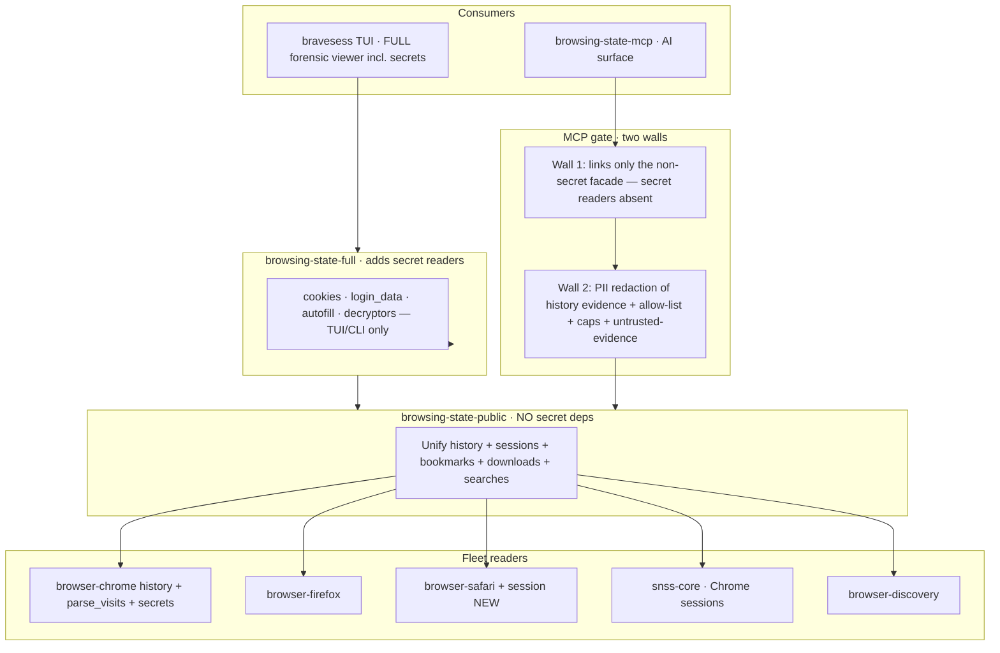

# Browser History / State Browser + MCP — Scoped Build Plan

*Lands inside `~/src/browser-forensic`. Built from the cross-browser research (Chromium,
Firefox, Safari, mobile, encryption) and constrained to a hard no-secrets boundary.*

## Executive Summary

`brave-browser-sessions` becomes the **history / state browser** of the `browser-forensic`
fleet: a read-only, cross-browser viewer (TUI) plus an **MCP server**. As a *forensic* tool
the library and TUI read **everything** — history, browser state, **and secrets** (cookies,
Login Data/passwords, autofill, and DPAPI/Keychain/NSS-decrypted values) — because tokens,
session cookies, and credentials pivot into cracking cases. The **no-secrets wall lives at
the MCP**, not in the library: the agent surface must never leak a secret into an AI.

The MCP gate has **two walls** (per the Codex critique): (1) it **does not link the secret
readers** — a structural, compile-time guarantee that no cookie/password/token can be served
to the model; and (2) it **redacts PII from the history evidence itself** before returning it,
because URLs carry reset tokens / OAuth codes / API keys, and search terms and download paths
are sensitive. Agent responses are allow-list-gated, bounded, provenance-tagged, and all
stored page text is labelled untrusted-evidence.

## 1. Scope & the MCP gate (the load-bearing decision)

| Capability | Forensic library + TUI (local human) | MCP (AI surface) |
|---|---|---|
| Visited URLs + titles + timestamps | ✅ full | ✅ **redacted** (query strings stripped, token/email/key patterns masked) |
| Open / recently-closed tabs, windows | ✅ full | ✅ redacted |
| Bookmarks, Top Sites, Reading List, Downloads metadata, Search terms, Favicons | ✅ full | ✅ redacted, bounded |
| **Cookies** (incl. decrypted values) | ✅ full forensic value | ❌ **never served**; readers not linked into the MCP binary |
| **Passwords / Login Data** (decrypted) | ✅ full | ❌ never served; not linked |
| **Form fills / autofill / credit cards** | ✅ full | ❌ never served; not linked |
| **Secret decryption** (Keychain / DPAPI / NSS, `encrypted_value`/`password_value`, ABE v20) | ✅ opt-in + audited (forensic use) | ❌ never served; decrypt crate not a dependency |

**Enforced by construction at the MCP:** the MCP binary depends only on a **non-secret facade**
(`browsing-state-public`) whose public types **cannot name** a cookie, password, autofill value,
or decrypted blob, plus a **redaction layer**. The full forensic readers (cookies, login_data,
autofill, decryptors) are reachable by the TUI/CLI/library but are **not in the MCP's dependency
graph**, so the dangerous values are not merely policy-hidden — they are not compiled into the
agent server. (This likely means splitting the no-secret reading surface into its own crate/
feature so the MCP can depend on it without the secret modules.)

## 2. Cross-browser coverage (from the research; history/state subset)

| Family | Browsers | Desktop OS | Mobile | History | Sessions/Tabs | Bookmarks/Downloads | Status |
|---|---|---|---|---|---|---|---|
| **Chromium** | Chrome (stable/beta/dev/canary), Brave, Edge, Opera, Vivaldi, Samsung Internet, Arc | mac/Win/Linux | Android (root/FS), iOS (WebKit, own DBs) | `urls`+`visits` (reuse `browser-chrome`; **add `parse_visits`**) | SNSS (`snss-core`) incl. modern `Sessions/` folder **and** mobile `Session_<ts>`/`app_tabs/` | reuse `browser-chrome` | Core reuse + new visits/session |
| **Firefox/Gecko** | Firefox, Dev Ed, Nightly, ESR, Tor, LibreWolf, Waterfox, Fenix | mac/Win/Linux | Android (Fenix), iOS (WebKit, `browser.db`) | `moz_places`/`moz_historyvisits` (reuse `browser-firefox`) | `sessionstore.jsonlz4` + `recovery.jsonlz4` (reuse) | reuse | Reuse existing |
| **Safari/WebKit** | Safari + all iOS browsers (WebKit-mandated) | macOS | iOS (backup/FS) | `History.db` (reuse `browser-safari`) | `BrowserState`/`SafariTabs`/`CloudTabs` (**new**) | reuse | Reuse + new session reader |

Key facts the readers must honor (verified in research): **epoch zoo** — Chromium WebKit-µs-
since-1601, Firefox PRTime-µs-since-1970, Safari Core-Data-since-2001 (`browser-core` already
has these conversions); **redirect-chain collapse** via Chromium `transition` qualifiers
(CHAIN_START/END, CLIENT/SERVER_REDIRECT) so counts/recency aren't polluted; **WAL capture**
(`-wal`/`-shm`) or you miss the newest visits; **schema drift** → introspect `sqlite_master`,
never hardcode columns; **profile discovery** per family/channel (reuse `browser-discovery`).

## 3. Architecture inside the fleet

`snss-core` moves into the workspace as `crates/snss-core` (lib `snss`) — the fleet's missing
Chrome session reader — and `browser-chrome` gains `session::parse_session()` adapting it to
the fleet `BrowserEvent` model. `browsing-state-public` is the no-secret reading surface (the
MCP's only data dependency); `browsing-state-full` adds the secret readers for the TUI/CLI. A
later `snss-forensic` adds Observations.

## 4. The TUI (build now) — full forensic viewer

The TUI is the **local analyst's** surface, so it sees everything. **MVP first** (Codex):
Chromium **session state + history visits** (redirect-collapsed, WAL-aware, timestamp-
normalized), with profile/source selection and local search — this proves the `snss-core`
migration, `parse_visits`, and WAL handling. *Then* broaden to all sources across all
installed browsers/profiles: Live tabs · Recently closed · History timeline · Bookmarks ·
Downloads · Top sites · Searches — and, behind an explicit, audited toggle, the **forensic
secret views** (cookies, decrypted Login Data, autofill). Sources are a top level: `Browser →
Profile → {Source} → items`. Reuse the built search/sort/yank/export/tagging. Secret
decryption is opt-in and logged (it requires the live OS session / keychain anyway).

## 5. The MCP (build after the gate exists) — gated history/state for AI

Built **only after** the non-secret facade + redaction layer are proven. **Narrow first**
(Codex): start with the small, hard-to-abuse set, redacted by default, each bounded +
provenance-tagged (browser, profile, source-class, timestamp-basis, WAL-included,
`omitted_by_policy_count`) + untrusted-evidence-labelled:

| Tier | Tool | Returns |
|---|---|---|
| **MVP** | `list_browsers()` | Installed browsers/profiles |
| **MVP** | `open_tabs()` / `recently_closed()` | Live + closed tab state (redacted) |
| **MVP** | `browsing_context(minutes≤30)` | Open tabs + recent visits (redirect-collapsed) + recent searches |
| **MVP** | `did_user_visit(query, within?)` | Matches with last-seen + visit_count |
| Later, stricter caps | `find_in_history` · `timeline` · `recent_searches` · `frequent_sites` | Only once proven not to be soft "dump" primitives |

**Two structural guarantees:** the MCP binary does **not** link the cookie/password/autofill/
decrypt readers (no secret can be returned), and every history value is **redacted** (query
strings stripped, token/email/key patterns masked) before it leaves the process. No `dump_all`.

## 6. Migration mechanics — and the blocker

`browser-forensic` currently has **50 modified files + a modified workspace `Cargo.toml`** and
untracked `.github/`, `docs/plans/`, `deny.toml`. **I need that WIP committed or stashed before
I move us in** — otherwise my additions (new crates + `members` edits to the dirty `Cargo.toml`)
entangle with your in-flight work and can't be reviewed or reverted cleanly.

Once clear, the migration (on a branch): (1) add `crates/snss-core` + tests to the workspace;
(2) add `crates/browsing-state` (no-secret deps) + `browser-chrome::session` adapter +
`parse_visits`; (3) move the TUI in as `crates/bravesess`; (4) add `crates/browsing-state-mcp`;
(5) wire `bw-cli` subcommands if wanted. Strict TDD throughout; nothing touches the secret paths.

## 7. Roadmap

- **P1 — Policy + visits + scope crate.** `browsing-state` skeleton, `parse_visits` (redirect-
  collapse), allow-list policy, no-secrets dependency boundary. *(gate before exposure)*
- **P2 — MCP (build now).** Session tools immediately (snss-core); history tools as `parse_visits`
  lands. Allow-list + provenance + untrusted-evidence.
- **P3 — TUI (build now).** Cross-browser sources + history timeline + global search.
- **P4 — Breadth.** Firefox + Safari session readers; mobile (acquisition-gated, parse-from-image);
  more channels/forks; `snss-forensic` Observations.
