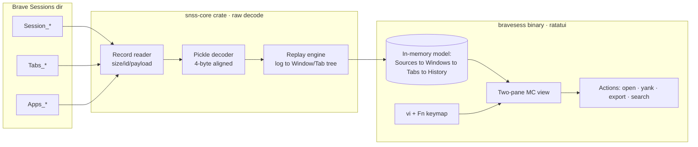

# Brave Session Browser (TUI) — Design

A Midnight-Commander-style, vi-keyed terminal browser for Brave's on-disk session
store at `~/Library/Application Support/BraveSoftware/Brave-Browser/Default/Sessions`.

## Executive Summary

**What it is.** A read-only, two-pane terminal UI that lets you walk every window,
tab, and navigation-history entry Brave has persisted — including *recently-closed*
tabs — without launching the browser. Open any URL in your default browser, yank it
to the clipboard, full-text search across thousands of entries, and export a session
to JSON/Markdown.

**Why it can exist.** The on-disk format (`SNSS` v3) has been fully decoded against
the live files on this machine: **1,821 navigation entries** parsed from the current
`Session_*` file and **101** from the latest `Tabs_*` file with **zero parse
failures**. URLs, titles, tab grouping, and navigation indices all extract cleanly.

**Shape of the build.** A `snss-core` reader crate (raw decode, `Read + Seek`,
no UI) plus a `bravesess` TUI binary (ratatui + crossterm). The reader is reusable
by forensic tooling; the TUI is a thin, idiot-proof consumer. Read-only by design —
the tool never writes to Brave's files.

**Recommended stack.** Rust, `ratatui` + `crossterm`, `arboard` (clipboard),
`open` (launch URL). Single static binary, no runtime deps.

---

## 1. Data Layer — Verified Format Facts

These are confirmed against the live files, not inferred from docs.

### 1.1 File container

```
offset 0   : magic  = "SNSS"        (4 bytes)
offset 4   : version = 3            (int32 LE)
offset 8.. : command stream
```

Command stream record (repeated to EOF):

```
uint16 size            # size of (id + payload), little-endian
uint8  command_id
byte   payload[size-1]  # raw Chromium Pickle (incl. its own 4-byte length header)
```

A `size == 0` or an over-long `size` terminates parsing gracefully (truncated tail
is normal — Brave appends live).

### 1.2 Two dialects

| File family | Meaning | Navigation cmd id | Other key cmds (observed) |
|---|---|---|---|
| `Session_*` | Live/last windows | **6** (`UpdateTabNavigation`) | 0 SetTabWindow, 2 TabIndexInWindow, 7 SelectedNavigationIndex, 19 SessionStorageAssoc, 21 LastActiveTime, 25 TabGroup |
| `Tabs_*` | Recently-closed (restore menu) | **1** (`UpdateTabNavigation`) | 2 RestoredEntry, 4 SelectedNavInTab, 5 PinnedState, 9 LastActiveTime |
| `Apps_*` | PWA/app windows | (same as Session) | small, optional |

Filenames carry a Windows-epoch timestamp suffix and **rotate while Brave runs** —
always glob `Session_*` / `Tabs_*` and pick by mtime; never hardcode a name.

### 1.3 Pickle decoding (the navigation payload)

The `UpdateTabNavigation` payload, after the 4-byte Pickle length header:

```
int32   tab_id           # SessionID — groups entries into tabs
int32   index            # position in that tab's back/forward history
string  url              # int32 byte-length, utf-8, padded to 4 bytes
string16 title           # int32 CHAR count, utf-16-le (2*count bytes), padded to 4
... (referrer, transition type, timestamps — optional, ignored for v1)
```

Alignment rule that makes or breaks the parser: **every field is padded to a 4-byte
boundary**, and `string16`'s length field is a *code-unit count*, not a byte count.

### 1.4 Reconstructing logical state from the log

The stream is append-only, so the *current* picture is a replay:

- Group `UpdateTabNavigation` records by `tab_id` → a tab's history.
- The tab's **current entry** = the one whose `index` matches the latest
  `SelectedNavigationIndex` (cmd 7) for that tab; absent that, the max index.
- `SetTabWindow` (cmd 0) maps `tab_id → window_id`; `TabIndexInWindow` (cmd 2)
  orders tabs left-to-right; `LastActiveTime` (cmd 21) drives recency sort.
- `Tabs_*` entries are each a standalone closed tab/window for the restore list.

---

## 2. Architecture



### 2.1 Crate split (follows the forensic-fleet `*-core` convention)

- **`snss-core`** — package `snss-core`, `[lib] name = "snss"` (the bare `snss`
  import path stays clean even if the crates.io name is taken). Pure decode over
  `Read + Seek`; returns a typed model. No UI, no I/O side effects, no clipboard.
  Reusable by a future `snss-forensic` analyzer (anomaly `Observation`s: dangling
  tab ids, impossible indices, mixed-version streams).
- **`bravesess`** — the TUI binary. Depends on `snss-core`. Owns the model→view
  mapping, keymap, and the four side-effecting actions.

### 2.2 Public reader API (secure-by-default sketch)

```rust
// snss-core — the safe path is the only easy path
pub struct SessionStore { /* sources discovered + decoded */ }

impl SessionStore {
    /// Open the default Brave profile's Sessions dir (read-only).
    pub fn open_default_profile() -> Result<Self, SnssError>;
    /// Open an explicit dir (other profiles, forensic images, copies).
    pub fn open_dir(path: &Path) -> Result<Self, SnssError>;

    pub fn sources(&self) -> &[Source];   // Current, Last, Recently-Closed, Apps
}

pub struct Source { pub kind: SourceKind, pub windows: Vec<Window>, pub path: PathBuf }
pub struct Window { pub id: i32, pub tabs: Vec<Tab>, pub last_active: Option<SystemTime> }
pub struct Tab    { pub id: i32, pub pinned: bool, pub current: usize, pub history: Vec<Nav> }
pub struct Nav    { pub index: i32, pub url: String, pub title: String }
```

Design guarantees baked into the types, not the docs:

- The reader **opens files copy-then-read** (snapshots bytes) so a live Brave
  rewrite can't yield a torn read; the model is immutable once built.
- A malformed command **degrades to a `Skipped` record with context**, never a
  panic and never a silent wrong value — `SessionStore::open_*` returns the model
  plus a `warnings()` list. Fail loud, not silent.
- No write path exists in the API surface. The tool **cannot** mutate Brave's
  store; that's structurally impossible, not merely "don't do that."

---

## 3. TUI — Midnight Commander Layout

Two independent panes, a Norton-style function-key bar, vi navigation. The left
pane is the **navigator** (a column in the Sources→Windows→Tabs→History hierarchy);
the right pane is the **viewer/preview** of the selected item. `Tab` swaps the
active pane (classic MC). Optional twin-navigator mode lets both panes browse
independently for side-by-side compare.

```
 Brave Sessions  ·  /…/Brave-Browser/Default/Sessions          12 win · 287 tabs
+------------------------------------+------------------------------------------+
| Windows  (Current Session)         | Tab 3/9  ·  github.com  · 5 history       |
|                                    |                                          |
|   Window 1   9 tabs   2m ago       |   0  chrome://newtab/      New Tab        |
| > Window 2  41 tabs   now      <== |   1  github.com/h4x0r      h4x0r          |
|   Window 3  12 tabs   1h ago       | > 2  github.com/.../pulls  Pull requests  |
|   Window 4   7 tabs   3h ago       |   3  github.com/.../issues Issues         |
|   ----------------------------     |   4  github.com/.../wiki   Wiki          |
|   Recently Closed  101 entries     |                                          |
|   Last Session     6 windows       |   URL  https://github.com/h4x0r/.../pulls |
|   Apps             1 window         |   Title  Pull requests · h4x0r           |
|                                    |   Tab id 1885544307 · pinned: no          |
+------------------------------------+------------------------------------------+
 /pull_                                                  3 matches  ·  n/N to cycle
 F1 Help  F3 View  F4 Yank  F5 Export  F7 Search  F8 OpenURL  F10 Quit
```

(Mock uses plain ASCII only — the real UI uses ratatui block borders.)

- **Left pane** drills the hierarchy: `l`/`Enter`/`→` descend
  (Source → Window → Tab → focus its history in the right pane), `h`/`←` ascend.
- **Right pane** shows the selected tab's full back/forward history with the
  current entry marked `>`, plus a detail footer (URL, title, tab id, pinned).
- **Status bar** shows the live search query + match count.
- **Function bar** mirrors MC's F-keys for discoverability by non-vi users.

---

## 4. Keybindings — vi-first, MC-compatible

Both schemes are live simultaneously. vi keys are primary; F-keys and arrows are
the discoverable fallback (cognitive-load: zero-knowledge users see the F-bar).

### Movement (vi)

| Key | Action |
|---|---|
| `h` `j` `k` `l` | left / down / up / right (pane-aware) |
| `g g` / `G` | top / bottom of list |
| `Ctrl-d` / `Ctrl-u` | half-page down / up |
| `Ctrl-f` / `Ctrl-b` | page down / up |
| `{` / `}` | previous / next window (jump across groups) |
| `Tab` | swap active pane (MC) |

### Search (vi)

| Key | Action |
|---|---|
| `/` | incremental search forward (URL + title, all sources) |
| `?` | incremental search backward |
| `n` / `N` | next / previous match |
| `*` | search the hostname under cursor |
| `Esc` | clear search / leave search mode |

### Actions

| Key | F-key | Action |
|---|---|---|
| `o` / `Enter`* | F8 | open URL in default browser (`open` crate) |
| `y` | F4 | yank URL to clipboard; `Y` yanks title + URL |
| `e` | F5 | export current node → JSON / Markdown |
| `v` | F3 | view: expand full history / raw metadata of selection |
| `/` | F7 | search |
| `?` | F1 | help overlay (full keymap) |
| `r` | — | reload from disk (re-snapshot live files) |
| `s` | — | cycle sort: recency / title / url / tab-count |
| `q` / `Ctrl-c` | F10 | quit |

\*`Enter` descends in the left pane, opens-URL in the right pane (context-aware,
so the common path needs the fewest decisions).

### Selection / bulk (MC-style)

| Key | Action |
|---|---|
| `Space` | tag / untag current row |
| `+` / `-` | tag / untag by glob (e.g. `*github.com*`) |
| `y` on a tag-set | yank all tagged URLs (newline-joined) |
| `e` on a tag-set | export all tagged |

---

## 5. Robustness & Edge Cases (distrust the happy path)

- **Live rewrite / rotation** — files are snapshotted (read fully into a buffer)
  before decode; `r` re-discovers by glob+mtime. A half-written tail just truncates
  the command stream cleanly.
- **File lock** — Brave holds these open; on macOS reads still succeed. If a read
  errors, surface it as a per-source warning and keep the other sources usable.
- **Malformed commands** — unknown `command_id`, bad Pickle length, non-UTF-8 URL,
  odd-length `string16`: each becomes a counted, contextual `warning`, never a
  panic or a silently-wrong row. (`?`/replacement chars shown, not hidden.)
- **Huge sessions** — 4 MB / 14 k commands parse in well under a frame; lists are
  virtualized (render only visible rows) so 287 tabs scroll smoothly.
- **Empty / missing dir** — clear message + the resolved path, not a stack trace.
- **Non-default profiles** — `open_dir` accepts any `Sessions` dir, incl. a
  forensic copy mounted read-only.

---

## 6. Build Milestones (strict TDD — RED then GREEN per step)

1. **`snss-core` record reader** — parse `(size,id,payload)` to EOF; fixtures from a
   *copied* real `Session_*` (never the live file). RED: assert command histogram
   matches the verified counts; GREEN: implement.
2. **Pickle decoder** — `int32`/`string`/`string16` with 4-byte alignment. RED:
   golden URLs/titles from §1.3; GREEN: decode.
3. **Replay engine** — log → `Source/Window/Tab/Nav` tree; recency + index logic.
4. **`bravesess` skeleton** — ratatui two-pane, left navigator, right viewer,
   `Tab` swap, `q` quit.
5. **vi keymap + F-bar** — movement, `gg/G`, pane awareness.
6. **Search** — incremental `/ ? n N *` across all sources.
7. **Actions** — `o` open, `y/Y` yank, `e` export JSON/MD, `r` reload, `s` sort.
8. **Tagging / bulk** — `Space`, glob `+/-`, bulk yank/export.

Validation per the Doer-Checker rule: every parser milestone is checked against the
**real on-disk bytes** (copied to a fixture), not synthetic Pickles I hand-built.

---

## 7. Out of Scope (v1) — flagged, not built

- Decoding referrer / transition-type / favicon / scroll-offset fields (present in
  the Pickle, unused by the UI). Add to `Nav` when a consumer needs them.
- Writing/restoring sessions back into Brave (would require careful, lock-aware
  append; deliberately excluded to keep the tool read-only and safe).
- Cross-profile aggregation and a `snss-forensic` anomaly analyzer (natural next
  crate; same reader, different consumer).
